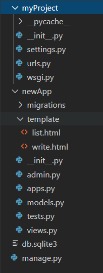

# Django

[TOC]


## MVT패턴


## 장고 설치

```
pip install django
```


## 프로젝트 시작하기

### 프로젝트 생성

##### 프로젝트 생성

```
$ django-admin startproject 프로젝트이름
```

##### app 생성

```
python menage.py startapp app이름
```

##### 실행

```
python manage.py runserver
```


### 프로젝트에 생성된 파일



##### manage.py

- 프로젝트 관리 명령어 모음

- 생성, 인증 관련

- 주요 명령어

   ```cmd
    #앱생성
    python menage.py startapp 앱이름
    
    #서버실행
    python manage.py runserver 0.0.0.0:8080
    
    #관리자 생성
    python manage.py createsuperuser
    
    #app에 변화 있는지 확인
    python manage.py makemigrations 앱이름
    
    #모델 변경 사항을 디비에 저장
    python manage.py migrate 
    
    #
    python manage.py shell
    
    #static 파일 한곳에 모음
    python manage.py collectstatic
   ```


##### myProject/

###### settings.py

:프로젝트 관련 설정 파일

```python
import os

# Build paths inside the project like this: os.path.join(BASE_DIR, ...)
BASE_DIR = os.path.dirname(os.path.dirname(os.path.abspath(__file__)))


# Quick-start development settings - unsuitable for production
# See https://docs.djangoproject.com/en/2.2/howto/deployment/checklist/

# SECURITY WARNING: keep the secret key used in production secret!
SECRET_KEY = '4#j_isxfl(y1@z+z%-mqiq#-3&gz+=su5@4u&2o7&m$y=c%4_v'

# SECURITY WARNING: don't run with debug turned on in production!
# 개발할때 True, 배포할때 False로 바꿔야함
DEBUG = True

ALLOWED_HOSTS = []


# Application definition
INSTALLED_APPS = [
    'django.contrib.admin',
    'django.contrib.auth',
    'django.contrib.contenttypes',
    'django.contrib.sessions',
    'django.contrib.messages',
    'django.contrib.staticfiles',
    '앱이름 추가',
]

MIDDLEWARE = [
    'django.middleware.security.SecurityMiddleware',
    'django.contrib.sessions.middleware.SessionMiddleware',
    'django.middleware.common.CommonMiddleware',
    'django.middleware.csrf.CsrfViewMiddleware',
    'django.contrib.auth.middleware.AuthenticationMiddleware',
    'django.contrib.messages.middleware.MessageMiddleware',
    'django.middleware.clickjacking.XFrameOptionsMiddleware',
]

ROOT_URLCONF = 'mysite.urls'

TEMPLATES = [
    {
        'BACKEND': 'django.template.backends.django.DjangoTemplates',
        'DIRS': [],
        'APP_DIRS': True,
        'OPTIONS': {
            'context_processors': [
                'django.template.context_processors.debug',
                'django.template.context_processors.request',
                'django.contrib.auth.context_processors.auth',
                'django.contrib.messages.context_processors.messages',
            ],
        },
    },
]

WSGI_APPLICATION = 'mysite.wsgi.application'


# Database
# https://docs.djangoproject.com/en/2.2/ref/settings/#databases

DATABASES = {
    'default': {
        'ENGINE': 'django.db.backends.sqlite3',
        'NAME': os.path.join(BASE_DIR, 'db.sqlite3'),
    }
}


# Password validation
# https://docs.djangoproject.com/en/2.2/ref/settings/#auth-password-validators

AUTH_PASSWORD_VALIDATORS = [
    {
        'NAME': 'django.contrib.auth.password_validation.UserAttributeSimilarityValidator',
    },
    {
        'NAME': 'django.contrib.auth.password_validation.MinimumLengthValidator',
    },
    {
        'NAME': 'django.contrib.auth.password_validation.CommonPasswordValidator',
    },
    {
        'NAME': 'django.contrib.auth.password_validation.NumericPasswordValidator',
    },
]


# Internationalization
# https://docs.djangoproject.com/en/2.2/topics/i18n/

LANGUAGE_CODE = 'en-us'

TIME_ZONE = 'UTC'

USE_I18N = True

USE_L10N = True

USE_TZ = True


# Static files (CSS, JavaScript, Images)
# https://docs.djangoproject.com/en/2.2/howto/static-files/

STATIC_URL = '/static/'

```

- DEBUG
  - True: 개발할때
  - False: 배포할때는
- INSTALLED_APPS
  - 서드파일 어플리케이션 사용
  - 
- MIDDELWQRE_CLASSES
- TEMPLATES
  - template와 관련된 설정
- DATABASE
- STATIC_URL 

###### urls.py

외부에서 접근할 url관리

```python
from newApp.views import *

urlpatterns = [
    url('',home, name ='home'), #기본루트
    url(r'^write/',write, name ='wirte'), #주소, 함수, 이름 
    url(r'^list/',list, name ='list'),
    url(r'^view/(?P<num>[0-9]+)/$',view, name ='view'),
]
```


##### newApp/

###### models.py

```python
from django.db import models

class Article(models.Model):
	name = models.Charfield(max_length=50);
    title = ;
    contents = models.TextField();
    email = ;
    cdate = models.DateTimeField(auto_now_add=True);
    
```

###### views.py

```python
from django.shortcuts import render
from community.forms import *

def write(request):
    if request.method == 'POST':
        form = Form(request.POST)
        if form.is_valid():
            form.save()	// 폼을 그대로 db에 저장, 변수랑 sql작성할 필요 없음
    else:
    	form = Form()
    return render(request,'write.html',{'form':form}) //렌더해서 wirte.html로 보냄

def list():
    articleList = Artice.objects.all()
    return render(request,'write.html',{'articleList':articleList})
    
def view(request, num='1'):
    article = Article.objects.get(id=num)
    return render(request,'view.html',{'article':article})

```


###### template/write.html

```html
<body>
    <form>
        {{form.as_p}} //p태그로 폼 만듦
         //에러 안나게 하려면 이거 추가
        <button>
    </form>
</body>
```

###### tmplate/list.html

```html
<body>
    <ul>   
        
        <li><a href="/view/{{article.id}}">{{article.title}}</a> | {{article.name}} | {{article.cdate|date:"D d M Y"}}
        
    </ul>
</body>
```

###### template/view.html

```html
<body>
    {{article.title}}
    <br>
    {{article.name}}
    <br>
    {{article.contents}}
    <br>
    {{article.email}}
    <br>
</body>
```


[출처] [https://github.com/onecue/django_comm...](https://www.youtube.com/redirect?redir_token=K89w6PZPmd7tYAZdfWatlJiUQYR8MTU4NzQwMTkwMUAxNTg3MzE1NTAx&v=Fn2XMeRmwe4&q=https%3A%2F%2Fgithub.com%2Fonecue%2Fdjango_community&event=video_description)