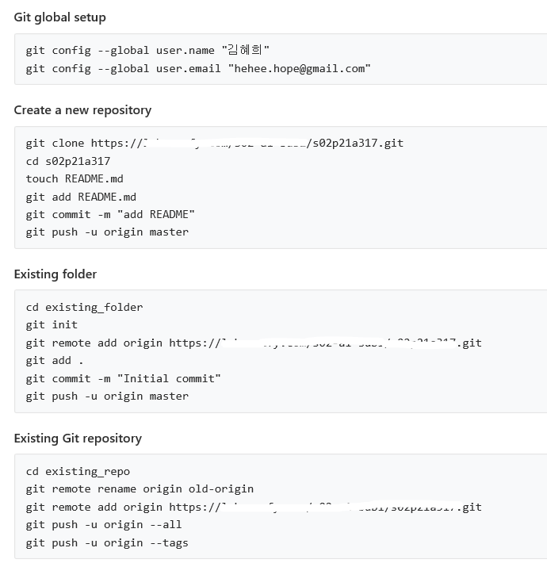
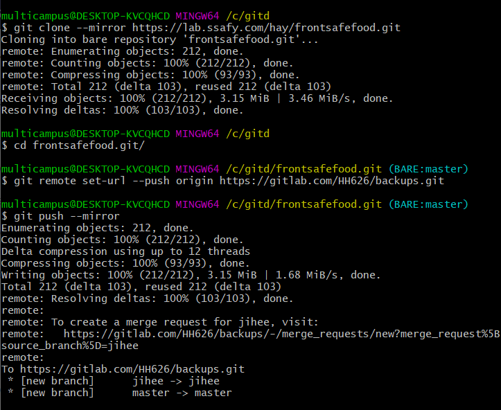

# Git

#### init




origin : 원격 저장소의 주소


## git 명령어

##### fetch

- 원격 저장소의 최신 이력

##### pull

- fetch + merge

##### add

- git add [파일] : stage area에 파일을 추가하여 commit 할 수 있도록 한다.

##### commit

- git commit -m ”mention” : stage area에 있는 파일들을 commit 한다.
- git commit -a -m ”mention” : 이미 추가된 파일이 수정 중인 상황에서 stage area에 올리지 않아도 stage area에 올리고 바로 commit 한다.

##### push

- git push origin master : origin 원격 저장소에 master 브랜치에 추가된 스냅샷들을 올린다.
- git push origin +master : origin 원격 저장소에 master 브랜치에 추가된 스냅샷들을 강제로 올린다.

##### remote

- git remote set-url origin [저장소주소] : 원격 저장소를 변경한다.
- git remote add [저장소] [저장소주소] : 원격 저장소를 추가한다.
- git remote -v : 원격 저장소 목록을 보여준다.

##### clone

- git clone [주소] [저장될 폴더] : git 원격 저장소에 있는 프로젝트를 내려받는다.
- git clone –depth [숫자] [주소] : 프로젝트가 많은 커밋들을 가지고 있을 경우 내려받는데 오래 걸리므로 depth 옵션을 사용하면 해당 숫자만큼의 최신 커밋들만 가지고 프로젝트를 내려받는다.

##### merge

- git merge [브랜치] : 현재 브랜치에서 입력한 브랜치와 합친다.

##### branch

- git branch : 브랜치 목록을 보여준다.
- git branch [브랜치] : 브랜치를 생성한다.
- git branch -d [브랜치]: 브랜치를 삭제한다.

##### checkout

- git checkout [브랜치] : 해당 브랜치로 이동한다.
- git checkout -b [브랜치] : 브랜치가 없으면 브랜치를 생성하고 이동한다.
- git checkout [폴더이름] : 해당폴더를 가장 최근 커밋 상태로 돌려 놓는다.


##### stash

- git stash : 변경된 내역들을 스택에 만들고 워킹디렉토리는 깨끗하게 비운다.
- git stash list : 스택에 저장된 내역들을 확인할 수 있다.
- git stash apply : 스택에 저장된 최신의 stash를 적용한다.
- git stash apply stash이름(ex.stash@{0}) : 스택에 저장된 stash중 이름이 같은 stash를 적용한다.
- git stash apply –index : Stage 상태로 스택에 저장된 stash를 Stage 상태까지 복원한다.

##### tag

- git tag : 만들어진 태그 목록을 보여준다.
- git tag [태그] : 태그를 만든다.
- git tag -l ‘v1.0′ : 1.0버전의 태그들만 검색하여 보여준다.

##### diff

- git diff : 파일 변경사항들을 보여준다.
- git diff [파일] : 해당 파일의 변경사항을 보여준다.

##### reset

- git reset [커밋] [파일] : stage area에 있는 파일들을 모두 특정 커밋으로 되돌린다.
- git reset --soft [커밋] : 수정사항을 유지하고 특정 커밋으로 되돌린다.
- git reset --hard [커밋] : 수정사항을 무시하고 특정 커밋으로 되돌린다.


##### mirror




http://minsone.github.io/git/git-command-list


## git error 해결

##### git 옮길때

```bash
git clone [주소]

cd [폴더]

git remote set-url origin [새저장소주소]

git push origin master
```

##### 용량 큰 git project 옮길때 (gitlab에서)

```bash
git clone [주소] --depth 1

cd [git있는 폴더]

git remote set-url origin [새저장소주소]

/* --depth 했을때 그냥 push하면 (shallow update not allowed)에러 생김 */

git remote add old [예전 저장소 주소]
git fetch --unshallow old

git push origin master
```


## git - jira 연동

http://blog.devenjoy.com/?p=507