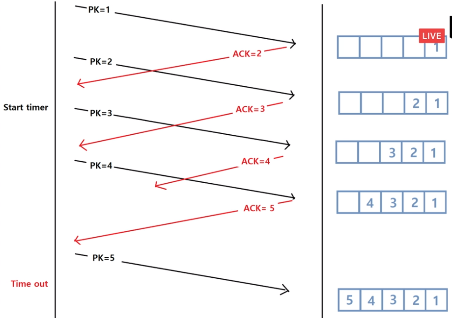

# 네트워크

|      |              |                   |      |      |      |
| ---- | ------------ | ----------------- | ---- | ---- | ---- |
| L7   | Application  | HTTP, FTP, Telnet |      |      |      |
| L6   | Presentation | SSL, GIF, TLS     |      |      |      |
| L5   | Session      | Token, Socket     |      |      |      |
| L4   | Transport    | Port, TCP, UDP    |      |      |      |
| L3   | Network      | IP, ICMP, ARP     |      |      |      |
| L2   | DataLink     | MAC               |      |      |      |
| L1   | Physical     | Ethernet, Fiber   |      |      |      |

[TOC]

네트워크 주소

- IP

- port

- mac

- 같은 네트워크에 속하는 네트워크 LAN

  바깥으로 나가는 네트워크 WAN

- ip는 서브넷 마스크로 네트워크 어드레스/ 호스트 어드레스 구분

  네트워크가 같으면 LAN -> 여기서 l2스위치가 mac을 보고 목적지 결정

  다르면 WAN -> l3라우터가 ip를 보고 목적지 결정

- LAN에서 통신하려면 L2switch만 있으면 됨

## L1

- 정해진 길로만 감
- IP, port, mac확인할 필요가 없음

## L2 Switch

- local area에서 보낼때 s
- 특정주소(mac주소)만 확인하여 어디로 보낼지 정함

## L3 Router

- 패킷 외부로 나갈때 거쳐야하는 곳
- IP주소 확인

### ARP

- LAN에 있는 특정 IP를 가진 host의 MAC을 얻어옴
- ARP table: ip에 대한 mac주소 매핑되어있음

### ICMP

IP를 가진 HOST와 통신이 되는지 확인

EX)ping 

## L4  

### TCP

#### TCP정의

- 신뢰성 통신
- Transport Layer
- 오류제어, 흐름제어, 혼잡제어
- streaming, 연결형

#### 네트워크의 문제

- 거리가 멀어지면 파형 변화(신호 감쇠) -> distortion, loss

- 자연재해로 인한 파형 변화 

- 처리 속도 차이

  ex)보내는쪽 100M/sec 받는쪽 10M/sec ->보내는 쪽에서 90M/sec drop => 보내는 쪽이 속도를 10M/sec으로

- 라우터가 100M/sec만 처리 가능한데 거기에 연결되있는 컴퓨터가 여러개(혼잡상황)

=>TCP로 해결

#### 흐름제어, 오류제어 방법

- 패킷을 세그먼트 단위로 나눠서 보냄

- 라우터에 다른 요청이 몰려서 다른 경로를 사용하여 순서가 바뀌는 문제 => 커널개발자가 해결

- stop & wait : ACK받으면 다음 패킷 보냄

- sliding window: 요청을 일단 여러개 보내고 ACK받음

  

	

ack가 안오면 time아웃

#### CRC

#### 혼잡제어

- 100M/sec처리하는 라우터에 100M/sec 2개가 요청올때 -> 100M/sec을 드랍해야함 1)두쪽다 50M/sec으로  나누기 
- 바쁘다는 이야기 안해줌
- 패킷 3개 보냄 -> ACK -> 5개 보냄 -> ACK -> 10개 보냄 -> time out -> 7개 보냄
- CWND(congestion window) : 패킷 몇개 보낼지, 보내는데 성공하면 늘리고 실패하면 줄임

#### MSS (Maximum Segment size)

- Maximum Segment size
- TCP에서 전송하는 User Data(L5~L7) 최대 크기
- MSS = MTU - L3 헤더 사이즈 - L4헤더 사이즈 
- cmd>> netsh interface ip show interface 로 MTU사이즈 확인가능
- 연결시 3way handshake로 MSS교환후 작은거 사용
- 

- streaming
  - MSS : 14K

    | Send       | Receive    |
    | ---------- | ---------- |
    | 7K, 7K, 1K |            |
    | 7K, 7K, 1K |            |
    | 7K, 7K, 1K |            |
    | 15K        |            |
    | 15K,20K    | 14K,14K,7K |
    |            |            |

  

- d

#### 3way handshake

#### wireshark

### 방화벽

외부 네트워크(WAN)에서의 공격(해킹, 악성코드)으로 부터 내부 네트워크(LAN)를 보호하는 방어도구

#### 종류

- Packet filter
- IDS/ IPS
- Web Application Firewall

##### Packet filter

###### reference

- https://www.crocus.co.kr/1362